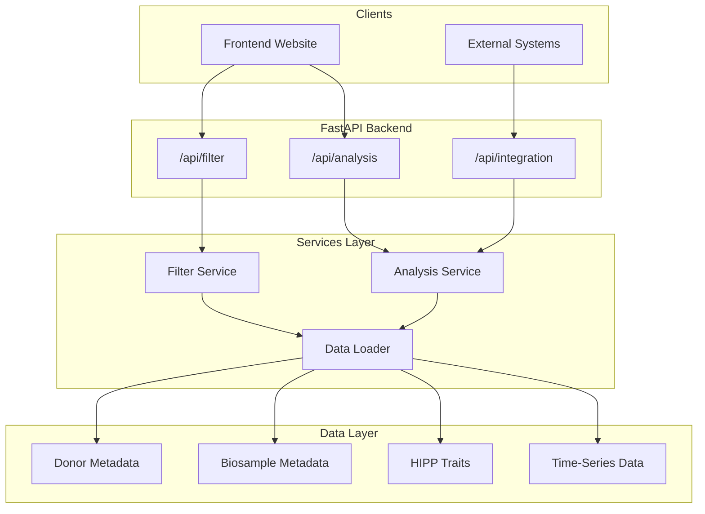

# PanKbase Functional Data API Backend

## Architecture Overview




## Data Relationships

The datasets link via these keys:

- **Donor → Functional Data**: `pankbase_human_donor.txt.RRID` = `HIPP_*.csv` column headers (e.g., `RRID:SAMN08769199`)
- **Biosample → Donor**: `biosamples.txt.Donors` = `pankbase_human_donor.txt.Accession`

## Project Structure

```
PanKbase_API/
├── app/
│   ├── __init__.py
│   ├── main.py                 # FastAPI entry point
│   ├── config.py               # Configuration settings
│   ├── models/
│   │   ├── __init__.py
│   │   ├── schemas.py          # Pydantic request/response models
│   │   └── enums.py            # Categorical field enums
│   ├── services/
│   │   ├── __init__.py
│   │   ├── data_loader.py      # Load and cache data
│   │   ├── filter_service.py   # Filter logic
│   │   └── analysis_service.py # Statistical analysis
│   ├── routers/
│   │   ├── __init__.py
│   │   ├── filter.py           # /api/filter endpoints
│   │   ├── analysis.py         # /api/analysis endpoints
│   │   └── integration.py      # /api/integration endpoints
│   └── utils/
│       ├── __init__.py
│       └── statistics.py       # Statistical helpers
├── data/                       # Existing data folder
├── tests/
│   └── ...                     # Unit tests
├── requirements.txt
└── README.md
```

## API Endpoints

### 1. Filter Endpoints (`/api/filter`)


| Endpoint                 | Method | Purpose                                                             |
| ------------------------ | ------ | ------------------------------------------------------------------- |
| `/api/filter/metadata`   | GET    | Get available filter options (categorical values, numerical ranges) |
| `/api/filter/donors`     | POST   | Filter donors by metadata criteria                                  |
| `/api/filter/timeseries` | POST   | Get time-series data for filtered donors                            |
| `/api/filter/traits`     | POST   | Get trait data for filtered donors                                  |
| `/api/filter/download`   | POST   | Download filtered data as CSV/JSON                                  |


**Filter Schema Example:**

```python
class FilterRequest(BaseModel):
    # Categorical filters (multi-select)
    gender: Optional[List[str]] = None           # ["male", "female"]
    collections: Optional[List[str]] = None      # ["HPAP", "nPOD", "IIDP"]
    diabetes_status: Optional[List[str]] = None  # ["control", "T1D", "T2D"]
    
    # Numerical range filters
    age_range: Optional[Tuple[float, float]] = None       # (18, 65)
    bmi_range: Optional[Tuple[float, float]] = None       # (18.5, 30)
    hba1c_range: Optional[Tuple[float, float]] = None     # (4.0, 14.0)
    
    # Biosample filters
    isolation_center: Optional[List[str]] = None
    purity_range: Optional[Tuple[float, float]] = None
```

### 2. Analysis Endpoints (`/api/analysis`)


| Endpoint                    | Method | Purpose                              |
| --------------------------- | ------ | ------------------------------------ |
| `/api/analysis/variables`   | GET    | Get available variables for analysis |
| `/api/analysis/association` | POST   | Run association analysis             |
| `/api/analysis/results`     | GET    | Get cached analysis results          |


**Analysis Request Schema:**

```python
class AssociationRequest(BaseModel):
    filter_criteria: FilterRequest           # Initial donor filter
    variables_of_interest: List[str]         # e.g., ["Age (years)", "BMI"]
    control_variables: List[str]             # e.g., ["Gender", "Collections"]
    traits: Optional[List[str]] = None       # Specific traits or all
    analysis_method: str = "linear_regression"  # or "correlation", "anova"
```

### 3. Integration Endpoints (`/api/integration`)


| Endpoint                    | Method | Purpose                             |
| --------------------------- | ------ | ----------------------------------- |
| `/api/integration/analyze`  | POST   | Analyze with external variable data |
| `/api/integration/register` | POST   | Register external data source       |


**Integration Schema (for future gene expression, etc.):**

```python
class ExternalDataRequest(BaseModel):
    filter_criteria: FilterRequest
    external_data: Dict[str, Dict[str, float]]  # {donor_id: {var_name: value}}
    # OR
    external_api_url: Optional[str] = None      # Fetch from external portal
    variables_of_interest: List[str]
    control_variables: List[str]
```

## Key Implementation Details

### Data Loading (`[app/services/data_loader.py](app/services/data_loader.py)`)

- Load all CSV/TSV files into pandas DataFrames at startup
- Create merged DataFrame joining donor + biosample + traits via linking keys
- Cache data in memory for fast filtering
- Provide method to reload data if files change

### Filter Service (`[app/services/filter_service.py](app/services/filter_service.py)`)

- Build dynamic query from filter criteria
- Support categorical (isin) and numerical (between) filters
- Return filtered donor IDs, then fetch corresponding time-series columns

### Analysis Service (`[app/services/analysis_service.py](app/services/analysis_service.py)`)

- Use `statsmodels` for regression analysis (OLS with control variables)
- Use `scipy.stats` for correlation and ANOVA
- Return p-values, coefficients, confidence intervals

### Statistical Methods

- **Linear regression**: For continuous variables of interest
- **Logistic regression**: For binary outcomes
- **ANOVA/Kruskal-Wallis**: For categorical variables of interest
- Control variables handled via multiple regression

## Technology Stack

- **FastAPI**: Async web framework with automatic OpenAPI docs
- **pandas**: Data manipulation and filtering
- **statsmodels**: Statistical analysis (OLS, logistic regression)
- **scipy**: Additional statistical tests
- **pydantic**: Request/response validation
- **uvicorn**: ASGI server

## Local Testing Setup

Yes, building a simple test frontend is recommended. Options:

1. **FastAPI's built-in Swagger UI** (`/docs`): Sufficient for API testing
2. **Simple Streamlit app**: Quick interactive dashboard for visual testing
3. **Static HTML + JavaScript**: Minimal frontend to test filter interactions

I recommend **Option 2 (Streamlit)** for testing because:

- Quick to build (single Python file)
- Interactive filters and visualizations
- No frontend expertise required
- Easy to share with team

## Files to Create


| File                               | Purpose                                            |
| ---------------------------------- | -------------------------------------------------- |
| `app/main.py`                      | FastAPI app initialization and router registration |
| `app/config.py`                    | Data paths, server settings                        |
| `app/models/schemas.py`            | All Pydantic models for requests/responses         |
| `app/services/data_loader.py`      | Load and merge all datasets                        |
| `app/services/filter_service.py`   | Filtering logic                                    |
| `app/services/analysis_service.py` | Statistical analysis                               |
| `app/routers/filter.py`            | Filter endpoints                                   |
| `app/routers/analysis.py`          | Analysis endpoints                                 |
| `app/routers/integration.py`       | External integration endpoints                     |
| `requirements.txt`                 | Dependencies                                       |
| `test_app.py`                      | Streamlit test application                         |


